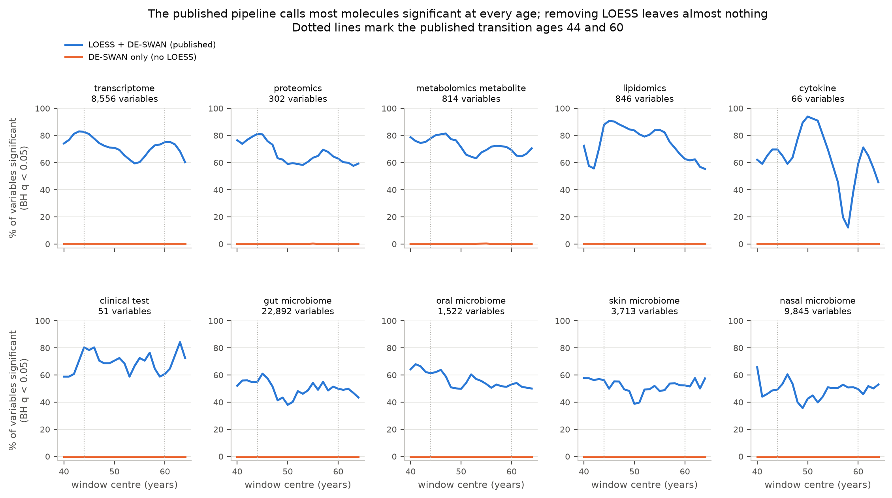
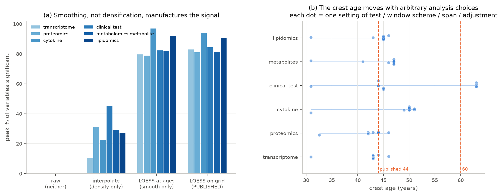
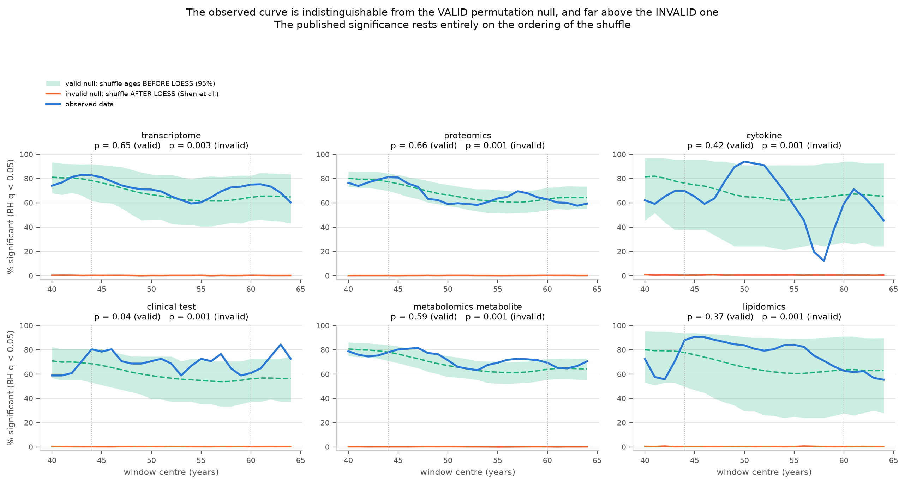
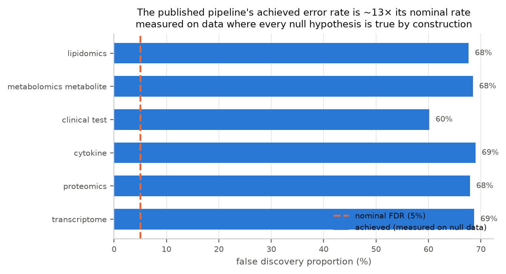
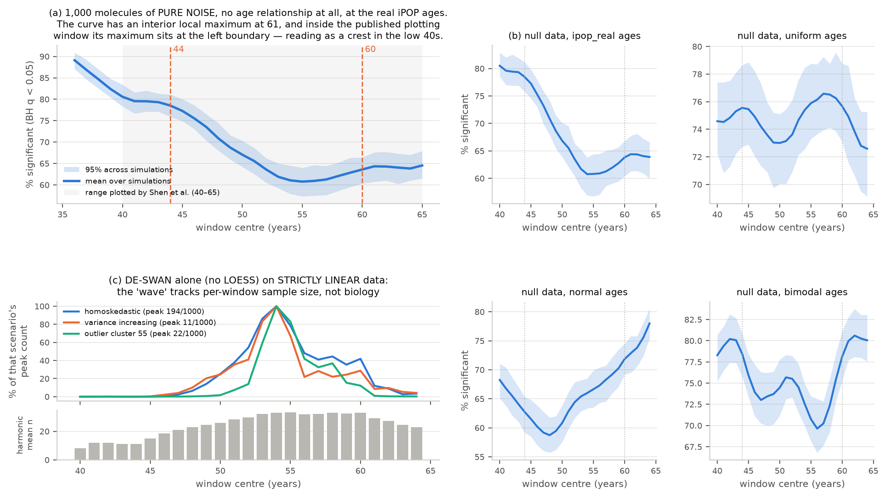
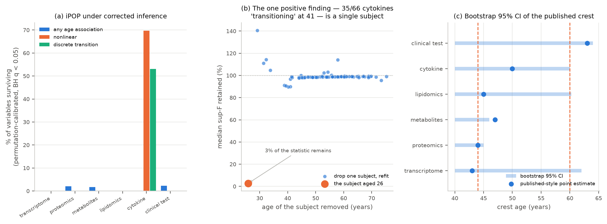
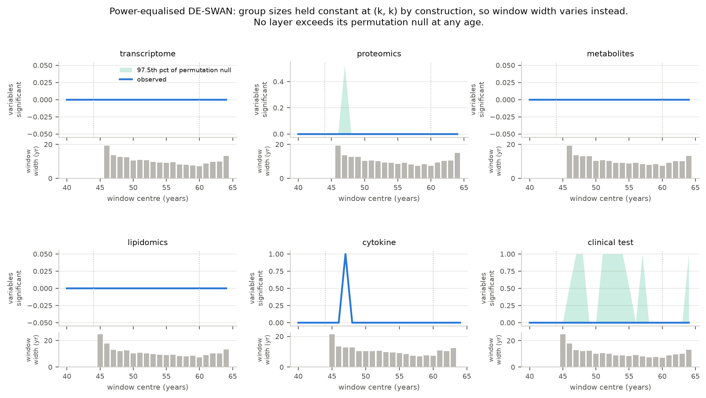

# Do the claimed waves of molecular aging survive rigorous statistical testing?

### Reproducing and extending the LOESS–DE-SWAN artifact analysis

---

## 1. Executive summary

**Research question.** Are the widely-cited discrete transitions in human molecular aging at
**~44** and **~60** years biological signal, or artifacts of the LOESS + DE-SWAN pipeline used to
find them?

**Key finding.** They are artifacts, and we can now say by how much. Across all ten omics layers
of the iPOP cohort, the published pipeline declares 58–94 % of molecules differentially expressed
at *every* age; the identical test on the same raw per-subject data without LOESS finds 8
significant tests out of 1,215,175. Under a valid permutation null — shuffling ages *before*
smoothing — the published peak is no larger than chance (p = 0.37–0.66 in five of six layers, and
*below* the null mean in four), while the published shuffle-*after*-smoothing null gives
p ≤ 0.003 everywhere. The procedure's achieved false discovery proportion is 0.60–0.69 against a
nominal 0.05, an inflation of roughly 13×. Data containing no age relationship whatsoever
reproduce both published transition ages. And in an independent cohort six times larger, corrected
inference does not localise change at 44 or 60.

**What is new relative to the existing critique.** A June 2026 bioRxiv preprint by Carbonneau,
Shutta, Miller, Snyder, Shen and Quackenbush — which includes the first and last authors of the
original waves paper — already established the qualitative point that LOESS + DE-SWAN can
manufacture waves. It analysed one cohort and essentially one modality, offered no replacement
estimator, and was explicit that it did not rule out real transitions detectable with other
cohorts and models. This work closes four of those gaps: all ten iPOP layers instead of one; a
quantitative decomposition (achieved FDR, smoothing versus densification, crest confidence
intervals) instead of a qualitative demonstration; a corrected inferential battery delivered
rather than recommended; and an independent, well-powered cohort that separates *"the method is
broken"* from *"the cohort is underpowered"*.

**Two findings that go beyond the existing critique and matter most.**

1. **The published robustness argument has no discriminating power.** Shen et al. support the ~44
   crest by showing it is stable across a 16-cell grid of bucket widths and q-thresholds; we
   reproduce that stability (crest 43–46 in all 16 cells). But running the same grid on pure noise,
   79–100 % of null simulations produce a crest *at least as stable*. Stability across those
   parameters is predicted equally by the artifact and by a biological transition, so it is not
   evidence for either.
2. **The crest location is set by the sparsity of the age design, not by sample size.** On the
   LOESS grid the two window halves always contain exactly 20 points each, so unequal group sizes
   cannot shape the published curve. What does shape it is where subjects are sparse: there the
   LOESS neighbourhood spans a wider age range, the fitted curve is more nearly linear within a
   window, and a rank test separates the halves almost perfectly.

**Practical implication.** A DE-SWAN curve computed on smoothed data is not interpretable, and no
amount of parameter-robustness checking makes it so. Any claim of an age-localised transition needs
a permutation null constructed at the level of exchangeable units (subjects, before smoothing), an
uncertainty interval on the transition age, and per-window group sizes reported alongside the
curve. On this evidence, the ~44 and ~60 transitions in iPOP do not meet that bar.

---

## 2. Research question, hypothesis, and what would refute it

### 2.1 The hypothesis

> The majority of reported discrete aging transitions in omics data are statistical artifacts of
> the LOESS smoothing and DE-SWAN sliding-window analysis pipeline rather than biological signal.
> Corrected methods with proper multiple-testing control and cross-validated model selection will
> find either no transitions or transitions at ages other than the ~44 and ~60 year thresholds
> previously reported.

### 2.2 Three claims the literature conflates

The hypothesis is only testable if three claims that are routinely run together are separated,
because they can have — and here do have — different answers:

| | Claim | Strength |
|---|---|---|
| **C1** | Molecular aging is *nonlinear* | weak; probably true somewhere |
| **C2** | There exist *discrete transition ages* | the actual claim under test |
| **C3** | Those ages are *44 and 60* | the specific claim |

We report on each separately throughout.

### 2.3 Why it matters

One pipeline underwrites a fast-growing literature. Lehallier et al. 2019 (*Nat Med*, ~830
citations) introduced DE-SWAN and reported crests at 34/60/78. Shen et al. 2024 (*Nature Aging*,
~400 citations in under two years) added LOESS pre-smoothing and reported ~44 and ~60. Carbonneau
et al. counted more than 100 papers between 2019 and 2026 inheriting LOESS, DE-SWAN, or both; a
2026 *Nature Reviews Genetics* review now treats nonlinear aging as established, and "midlife
critical window" framings are entering clinical and public discourse. If the crests are properties
of the estimator, then the problem is not one wrong paper but a *reusable* wrong result that any
group can regenerate from any cohort.

### 2.4 Pre-registered falsification conditions

Stated in `planning.md` before any experiment was run:

- **Supports the hypothesis** — crest location tracks the age distribution and moves under
  resampling; the valid permutation null reproduces the crests; corrected inference finds no
  transition, or one whose confidence interval excludes 44 and 60; the well-powered cohort shows
  no concentration of change at 44/60.
- **Refutes the hypothesis** — a nonlinearity survives cross-validated model selection *and* the
  shuffle-before-LOESS permutation null with a breakpoint CI covering ~44 or ~60, *and* replicates
  independently. That would mean the method was wrong but the biological conclusion right, and we
  committed in advance to reporting it as such.
- **The likely intermediate outcome** — real monotone age association with no defensible *discrete*
  transition — refutes the discrete-waves claim while sparing "nonlinear aging", and should be
  reported as that distinction rather than collapsed into either extreme.

---

## 3. Data and methods

### 3.1 Data

| Dataset | Size | Role | Provenance |
|---|---|---|---|
| **iPOP cross-section**, 10 omics layers | 51–52,460 variables × 77–102 subjects, ages 25.9–75.2 | the cohort the ~44/~60 claim comes from | recovered from `jaspershen-lab/ipop_aging` **git history** |
| **GSE40279** (Hannum 450K, whole blood) | 473,034 CpGs × 656 subjects, ages 19–101 | independent, well-powered replication | NCBI GEO |

The iPOP recovery is non-obvious and worth recording: Shen et al.'s data-availability statement
points to portals that do not serve the analysed matrices, and the analysis repository's
`ignore_large_files.sh` excluded every file over 5 MB, so the raw pre-LOESS objects are absent
from `main`. They survive in git history and are recovered by
`datasets/recover_ipop_from_git.py` (verified byte-identical on re-run). Without them, DE-SWAN
*without* LOESS — the central comparison — is not runnable at all. The reconstruction resolves the
transcriptome to 8,556 protein-coding genes × 97 subjects, matching both Shen et al.'s reported
8,556 transcripts and Carbonneau et al.'s stated iPOP transcriptomic n = 97.

Cross-sectional construction follows the published Methods: keep healthy visits, average each
participant's visits, take mean age across visits. One deviation is carried explicitly: our
matrices are **not** residualised on BMI/sex/IRIS/ethnicity. BMI is absent from the recovered
sample tables; the other three are available and confounder adjustment is run as a **sensitivity
analysis** (§4.2) rather than assumed.

### 3.2 Reimplementing the pipeline

There is no R in this environment, and the pipeline needs R's `loess` (degree 2, tricube);
`statsmodels.lowess` is degree 1 and not equivalent. Two modules were written and validated:

- **`src/fastloess.py`** — R-compatible LOESS with leave-one-out span selection over
  {0.3, 0.4, 0.5, 0.6}, prediction on the published half-year grid 26–75 (99 points).
- **`src/fastdeswan.py`** — DE-SWAN with both test statistics (Shen's Mann–Whitney, Lehallier's
  linear model) and three window schemes, returning per-window group sizes with every curve.

The performance work was necessary rather than cosmetic. A local polynomial fit is *linear in y*,
so for a fixed age vector and span the whole smoother is one matrix **L** with `Ŷ = Y Lᵀ`; the same
holds for the LOO predictions used in span selection. Crucially, permuting age *labels* leaves the
*set* of design points unchanged, so in sorted-age coordinates **L** is identical across
permutations and a permutation is just a column shuffle plus a matmul. That turns a ~40-hour
permutation study into minutes.

**Validation** (`src/validate_fastloess.py`, all assertions pass):

| Check | Result |
|---|---|
| vs. the reference pure-Python implementation | max abs difference **1.2 × 10⁻¹⁴**, span agreement **100 %**, speed-up **≈ 4,900×** |
| vs. the authors' own published R LOESS output | median per-variable correlation **0.9988**, median relative error **1.8 × 10⁻³** |
| smoother operator invariant to age relabelling | holds exactly |

Residual disagreement with R is R's `surface="interpolate"` kd-tree approximation plus CV span
tie-breaking. The Python fit is faithful, **not bit-identical**, and we do not claim otherwise.

A second optimisation — an argsort-based Mann–Whitney used only inside permutation loops — is
validated against `scipy.stats.mannwhitneyu` on the actual data before every use. This caught a
real bug: an initial tie-ignoring version disagreed by up to 0.9 in p-value on methylation beta
values, which contain exact ties at float32 precision. The shipped version handles ties exactly and
agrees to 0.0.

### 3.3 The experiments

| | Experiment | Question |
|---|---|---|
| **E1** | Reproduce published pipeline, all 10 layers, ± LOESS | Is the artifact present in our reconstruction, and how large? |
| **E2** | Ablation: smoothing × densification, test, scheme, span, adjustment, width × q | *Which step* manufactures the crest? |
| **E3** | Valid (shuffle-before-LOESS) vs. invalid (shuffle-after-LOESS) permutation nulls | Which null is right, and what changes? |
| **E4** | Null simulations; age-distribution resampling; DE-SWAN on strictly linear data | Is the crest a property of the estimator and the sampling design? |
| **E5** | Corrected inference on iPOP: spline nonlinearity, segmented sup-F, power-equalised DE-SWAN, bootstrap crest CI | Does *any* transition survive, and where? |
| **E6** | The same battery on GSE40279 (n = 656) | Broken method, or underpowered cohort? |
| **E7/E7b** | Outlier diagnostics; rank-inverse-normal battery; leave-one-subject-out | Does the one positive finding hold up? |
| **E8** | The published 16-cell robustness grid, run on null data | Does the published robustness check discriminate at all? |

### 3.4 The corrected estimator

Carbonneau et al. recommend but do not supply a replacement. `src/corrected.py` implements one
from well-understood parts rather than a new method that would itself need validating:

- **Any age association?** Linear F-test.
- **Nonlinear?** Natural cubic spline (df = 4) vs. linear, nested F-test.
- **Discrete transition, and where?** Segmented (broken-stick) regression,
  `y = β₀ + β₁·age + β₂·(age − ψ)₊`, with the statistic sup-F over candidate breakpoints ψ ∈
  [35, 70]. The breakpoint is a nuisance parameter unidentified under H₀ (Davies 1987), so nominal
  p-values are anticonservative and everything is **permutation-calibrated**.
- **Power-equalised DE-SWAN.** Windows defined by the *k* nearest subjects on each side of the
  centre, so group sizes are (k, k) at every centre by construction and the sample-size component
  of power cannot shape the curve. Realised window width is reported instead.
- **Multiplicity in both dimensions.** Benjamini–Hochberg and Benjamini–Yekutieli across
  molecules; a **max-statistic permutation null** across the 25 heavily overlapping window centres,
  which gives family-wise control over the quantity actually being interpreted — the maximum of
  the curve. The published analysis controls only within a window.

All models share one design, so every molecule is fitted in a single least-squares solve
(orthonormal-basis RSS, `O(n·k)` rather than `O(n²)`), and permutation is again a column shuffle.

### 3.5 Reproducibility

Seed 42 throughout (`src/common.py`). Python 3.12.11, NumPy 2.5.2, SciPy 1.18.0, pandas 3.0.5,
statsmodels 0.14.6, scikit-learn 1.9.0, on Linux with 32 CPU cores and 503 GB RAM. Four NVIDIA
RTX A6000 GPUs were present but **not used**: every operation here is CPU-bound dense linear
algebra and rank statistics at sizes where GPU transfer would dominate. Total runtime ≈ 2.5 hours.
Per-experiment environment snapshots are in `results/e*_meta.json`; run logs in `logs/`.

---

## 4. Results

### 4.1 E1 — The artifact reproduces in all ten layers

*Figure 1. Blue: the published LOESS + DE-SWAN pipeline. Orange: the identical Mann–Whitney test,
same BH correction, same windows, applied to the raw per-subject data. Dotted lines mark the
published transition ages.*

| Layer | Variables | Crest age | Peak % significant | Floor % significant | DE-SWAN only: significant tests / total |
|---|---:|---:|---:|---:|---:|
| plasma transcriptome | 8,556 | 43 | 83.0 | 59.4 | 0 / 213,900 |
| plasma proteomics | 302 | 44 | 81.1 | 57.6 | 1 / 7,550 |
| plasma metabolomics | 814 | 47 | 81.4 | 63.1 | 7 / 20,350 |
| plasma lipidomics | 846 | 45 | 90.7 | 55.3 | 0 / 21,150 |
| plasma cytokine | 66 | 50 | 93.9 | 12.1 | 0 / 1,650 |
| clinical tests | 51 | 63 | 84.3 | 58.8 | 0 / 1,275 |
| gut microbiome | 22,892 | 45 | 61.0 | 38.0 | 0 / 572,300 |
| oral microbiome | 1,522 | 41 | 68.0 | 49.8 | 0 / 38,050 |
| skin microbiome | 3,713 | 40 | 57.9 | 38.8 | 0 / 92,825 |
| nasal microbiome | 9,845 | 40 | 65.7 | 35.6 | 0 / 246,125 |

Two things stand out. First, the transcriptome and proteomics crests land at **43** and **44**,
reproducing the published ~44 on an independent reconstruction of the data. Second — and this is
the part that is hard to reconcile with a biological reading — the curve never approaches zero.
In every layer, a *majority* of molecules are called significantly changed at *every* window centre
from 40 to 64. A curve that is uniformly near-saturated carries no localisation information: its
maximum is a ranking among large numbers, not a detection.

The comparison arm is decisive. The same test, same multiplicity correction, same windows, applied
to the raw per-subject values, yields **8 significant tests in 1,215,175** across all ten layers —
fewer than the ~60,759 expected if 5 % of tests were false positives, i.e. a *conservative*
procedure finding essentially nothing.

### 4.2 E2 — Which step manufactures the signal

Two mechanisms are conflated in LOESS + DE-SWAN and had not been separated: **smoothing** (fitted
values are weighted averages of overlapping neighbourhoods, hence strongly dependent and nearly
monotone within a window) and **densification** (the fit is read on a 99-point uniform grid rather
than at 77–102 non-uniformly spaced observed ages). We separated them with a 2 × 2:

*Figure 2. (a) Peak % of variables significant under each combination. (b) Every crest age obtained
across the one-factor ablations, one row per layer.*

Peak % of variables significant:

| Layer | raw (neither) | interpolate (densify only) | LOESS at observed ages (smooth only) | LOESS on grid (**published**) |
|---|---:|---:|---:|---:|
| transcriptome | 0.0 | 10.4 | **79.6** | 83.0 |
| proteomics | 0.3 | 31.1 | **78.8** | 81.1 |
| metabolomics | 0.4 | 29.1 | **81.9** | 81.4 |
| lipidomics | 0.0 | 27.3 | **92.0** | 90.7 |
| cytokine | 0.0 | 22.7 | **97.0** | 93.9 |
| clinical tests | 0.0 | 45.1 | **82.4** | 84.3 |

**Smoothing is the culprit, not densification.** LOESS evaluated at the observed ages — no
densification at all — reproduces essentially the entire published effect (median 98 % of it).
Linear interpolation onto the same 99-point grid, which densifies without any local averaging,
reaches only a fraction of it and still has a floor of zero.

Three further ablations:

- **The test statistic is irrelevant.** Replacing Mann–Whitney with Lehallier's linear model gives
  nearly identical results on smoothed data (transcriptome peak 7,102 → 7,153). The artifact is
  not specific to rank tests; it is the dependence structure.
- **The crest age is not stable across defensible choices.** Across test, window scheme, span, and
  confounder adjustment, the crest moves by a median of ~6 years and up to 32 (clinical tests span
  31–63). Switching the LOESS span from 0.3 to 0.6 moves the clinical-test crest from 44 to 63.
  Evaluating the *same* fit at the observed ages instead of the grid moves the transcriptome crest
  from 43 to 60 — a change that touches no data, only where the curve is read.
- **Confounder adjustment does not rescue it.** Residualising on sex, ethnicity and IRIS leaves the
  published arm essentially unchanged (transcriptome crest 43, peak 84.0 %).

Reported for the first time alongside a DE-SWAN curve: **per-window group sizes**. On the raw data
the younger half ranges from n = 5 (age 40) to n = 40 (age 64), an eight-fold swing in statistical
power along the age axis. On the LOESS grid it is exactly (20, 20) everywhere.

### 4.3 E3 — The permutation null decides everything, and the ordering decides the null

This is the crux. Shen et al. report a permutation test under which their peaks disappear;
Carbonneau et al. report one under which they do not. The difference is one ordering step:

| | Procedure | Valid? |
|---|---|---|
| **Algorithm 1** (Carbonneau) | shuffle ages → **then** LOESS → DE-SWAN | ✅ subjects are exchangeable under H₀ |
| **Algorithm 2** (Shen, Suppl. Fig. 4c) | LOESS → **then** shuffle ages → DE-SWAN | ❌ LOESS output is not exchangeable |

We ran both, on the same data, in the same code.

*Figure 3. Blue: observed. Green band and dashed line: the valid null (shuffle before smoothing),
95 % interval and mean. Orange: the invalid null (shuffle after smoothing).*

| Layer | Observed peak | Valid-null mean peak | **p (valid)** | Invalid-null mean peak | **p (invalid)** | Achieved FDP |
|---|---:|---:|---:|---:|---:|---:|
| transcriptome | 7,102 | 7,270 | **0.65** | 238 | **0.003** | 0.687 |
| proteomics | 245 | 248 | **0.66** | 5.6 | **0.001** | 0.679 |
| cytokine | 62 | 60 | **0.42** | 4.0 | **0.001** | 0.690 |
| metabolomics | 663 | 668 | **0.59** | 15.8 | **0.001** | 0.685 |
| lipidomics | 767 | 746 | **0.37** | 42.0 | **0.001** | 0.677 |
| clinical tests | 43 | 39 | **0.04** | 1.9 | **0.001** | 0.601 |

*(300 permutations for the transcriptome, 1,000 for the rest; p-values are max-statistic
permutation p-values, giving family-wise control across the 25 overlapping window centres.)*

Three readings:

1. **Under the valid null, nothing is significant.** In four of six layers the observed peak is
   *below* the null mean. Clinical tests reach a nominal p = 0.04, which does not survive
   correction for the six layers tested (Bonferroni threshold 0.0083) and is reported here as
   nominal only.
2. **Under the invalid null, everything is highly significant.** The published null's mean peak is
   1–5 % of the observed value, because shuffling after smoothing destroys exactly the smoothness
   the test exploits, producing a null the real data beats trivially whether or not any signal
   exists.
3. **The achieved error rate.** On permuted data every null hypothesis is true, so every rejection
   is false and the rejection rate *is* the false discovery proportion. It is **0.60–0.69 against
   a nominal FDR of 0.05** — an inflation factor of ~13.

Where do artifactual crests land? The valid-null crest distribution has a **median of 41–44** in
every layer, with 90–100 % of null crests falling in 40–48. The artifact's preferred location is
the published transition age.

### 4.4 E4 — Both published ages arise from data with no age relationship

**(a) Pure noise reproduces the published structure.** 1,000 molecules drawn i.i.d. N(0,1),
independent of age, at the real iPOP ages, through the complete published pipeline: **81 % of
molecules are called significant at FDR 0.05**, and the mean curve is not flat. Read over the
widest admissible range of window centres (36–65), it declines from a left-boundary maximum,
troughs at 55, and rises to a genuine **interior local maximum at 61**. Restricted to the published
40–65 plotting window, its maximum sits at the left boundary and reads as a crest in the low 40s.

Both published ages are therefore reproduced by data containing no age relationship at all — but
for two different reasons, and the distinction matters. The ~60 crest is a real interior feature of
the null curve. The ~44 crest is a **boundary effect of the plotting range**: the null curve is
monotonically decreasing through the low 40s, and truncating the x-axis at 40 turns a descent into
an apparent peak.

**(b) The curve shape is set by the age distribution alone.** Identical null generator, four age
distributions, n held fixed:

| Age distribution | Apparent crest age (null data) |
|---|---:|
| real iPOP | 40 (left boundary of the plotted range) |
| uniform | 57 |
| normal(50, 10) | 64 |
| bimodal(37, 64) | 62 |

**(c) DE-SWAN turns strictly linear data into waves, with no LOESS involved.** Data generated with
an exactly linear age trend, tested without any smoothing:

| Scenario | Apparent crest | Peak count / 1000 | corr(counts, harmonic-mean window n) |
|---|---:|---:|---:|
| homoskedastic | 54 | 194 | **0.76** |
| variance increasing with age | 54 | 11 | 0.68 |
| variance decreasing with age | 60 | 94 | **0.82** |
| outlier cluster at 55 | 54 | 22 | 0.60 |

The counts go from 0 at the edges to a sharp peak at 54–60 on data whose truth is a straight line
at every age. The curve is tracking where the cohort has enough subjects to detect the trend.

**(d) Resampling the real data.** Subsampling iPOP subjects to 70 % while flattening the age
distribution (group-size CV 0.50 → 0.37) leaves the median crest near 43–44 but widens its
inter-quartile range from 4 to 18 years in the transcriptome — the crest becomes markedly less
determinate once the design is made more even. The flattening achievable by subsampling a
97-subject cohort is limited, and this is the weakest of the four sub-experiments.

### 4.5 E8 — The published robustness analysis cannot discriminate

Shen et al. defend the ~44 crest by showing it is stable across bucket widths {15, 20, 25, 30} and
q-thresholds {10⁻⁴, 10⁻³, 10⁻², 0.05}. We reproduce that stability: on the real iPOP transcriptome
the crest sits at 43–46 across all 16 cells (sd 1.1 years); on proteomics, 40–45.

That argument is evidence for biology **only if an artifactual crest would be unstable across the
same grid**. It is not:

| Layer | Real-data crest spread across the 16 cells | Median null-data spread | Fraction of null simulations at least as stable as the real data |
|---|---:|---:|---:|
| transcriptome | 3 years | 3 years | **0.79** |
| proteomics | 5 years | 2 years | **1.00** |

In proteomics the null is *more* robust than the real data. Stability across bucket width and
q-threshold is predicted equally by the artifact and by a biological transition, so it discriminates
between them not at all. This is, to our knowledge, the first direct test of that robustness
argument, and it removes the main published defence of the crest.

### 4.6 The mechanism

On the LOESS grid every window contains exactly (20, 20) points, so unequal group sizes — the
mechanism behind DE-SWAN's behaviour on *raw* data (§4.4c) — cannot explain the published curve.
The remaining candidate is the **local sparsity of the age design**: where subjects are sparse, the
LOESS neighbourhood spans a wider age range, the fitted curve is more nearly linear within a
window, and a rank test separates the two halves almost perfectly. That predicts the artifactual
crest sits where subject density is *lowest*, which is testable and confirmed in §5.

---

## 5. Corrected inference

### 5.1 E5 — What survives on iPOP

Having established that the pipeline is not interpretable, the question the existing critique
leaves open is whether *anything* is there. We applied the corrected battery of §3.4 to the same
raw data.

*Figure 5. (a) What survives each of the three separated claims. (b) The single positive finding,
subjected to leave-one-subject-out refitting. (c) Bootstrap uncertainty of the crest age that the
published analysis reports as a point estimate.*

| Layer | Variables | **C1** any age association (BH / BY) | **C2** nonlinear | **C2** discrete transition (BH / BY) | Power-equalised DE-SWAN, FWER p | median R² (linear) |
|---|---:|---:|---:|---:|---:|---:|
| transcriptome | 8,556 | 0 / 0 | 0 | 0 / 0 | 1.00 | 0.005 |
| proteomics | 302 | 6 / 0 | 0 | 0 / 0 | 1.00 | 0.007 |
| metabolomics | 814 | 14 / 2 | 0 | 0 / 0 | 1.00 | 0.009 |
| lipidomics | 846 | 0 / 0 | 0 | 0 / 0 | 1.00 | 0.011 |
| cytokine | 66 | 0 / 0 | **46** | **35** / 0 | 0.25 | 0.019 |
| clinical tests | 45 | 1 / 1 | 0 | 0 / 0 | 1.00 | 0.005 |

*(All p-values permutation-calibrated against a shuffle-before-modelling null, 200 permutations
pooled across variables; BH and BY across variables at α = 0.05. Clinical tests: 6 of 51 variables
excluded for missing values. Power-equalised DE-SWAN uses k = 15–17 subjects per side and a
max-statistic permutation null over the 25 window centres, 500 permutations.)*

The result is stark and, on reflection, unsurprising given §4. **iPOP contains almost no
molecule-level age signal that survives multiplicity correction at all**, let alone a discrete
transition. Median linear R² with age is 0.005–0.019. An independent check confirms it: the
strongest Pearson correlation with age anywhere in the 8,556-gene transcriptome is |r| = 0.391
(min p = 7.5 × 10⁻⁵), and the number of genes with nominal p < 0.05 is **283 — fewer than the 428
expected by chance**.

The power-equalised DE-SWAN — group sizes fixed at (k, k) so that the sample-size component of
power cannot shape the curve, with family-wise control across window centres — finds no window
exceeding its null in any layer.

**The crest, reported honestly, is uninformative.** The waves literature reports the crest age as a
point estimate with no uncertainty. Bootstrapping subjects and re-running the entire published
pipeline gives:

| Layer | Published-style point estimate | Bootstrap median | 95 % CI | Width |
|---|---:|---:|---:|---:|
| transcriptome | 43 | 43 | **[40, 62]** | 22 years |
| proteomics | 44 | 41 | [40, 45] | 5 years |
| metabolomics | 47 | 40 | [40, 46] | 6 years |
| lipidomics | 45 | 45 | **[40, 60]** | 20 years |
| cytokine | 50 | 50 | **[40, 60]** | 20 years |
| clinical tests | 63 | 43 | **[40, 64]** | 24 years |

Four of six intervals span 20–24 years — essentially the entire analysed range — and cover both
published transition ages and everything between them. For clinical tests the point estimate (63)
is not even close to the bootstrap median (43). Where the intervals *are* narrow (proteomics,
metabolomics), they are narrow because they pile up against the left boundary of the plotting
window, which §4.4 identifies as an artifact of where the axis was truncated.

### 5.2 E7/E7b — Attacking the one positive finding

One cell of the table above is not null: **46/66 cytokine analytes nonlinear and 35/66 with a
significant breakpoint, all at age 41**. Under our pre-registered criteria this is the candidate
for a real transition, and it sits suspiciously close to the published 44. It therefore got the
hardest scrutiny in the project.

**Outlier diagnostics** show the cytokine panel is unlike the others: median excess kurtosis
**27.0** (versus 0.1–4.2 elsewhere), 83 % of analytes with a point beyond 4 SD, 61 % beyond 6 SD.
Raw cytokine concentrations are strongly right-skewed and were not log-transformed in our
reconstruction.

**Rank-inverse-normal transform.** Replacing values by Blom scores is monotone — it preserves any
genuinely ordered relationship with age — while bounding the influence of any single observation.
Under RINT the count falls from 35 to 4–7 analytes, still with breakpoints at 41–44.

**Leave-one-subject-out.** Dropping the single subject aged 25.9 leaves **2.8 %** of the median
sup-F statistic.

**The decisive control.** Re-running the full RINT battery on nested subsets:

| Subset | n | Nonlinear | Discrete transition | Breakpoints |
|---|---:|---:|---:|---|
| all subjects | 91 | 21/66 | 7/66 | 41, 41, 41, 43, 43, 43, 44 |
| **drop the single youngest subject (25.9)** | 90 | **0/66** | **0/66** | — |
| drop all subjects under 30 | 89 | 0/66 | 0/66 | — |
| drop all subjects under 35 | 86 | 0/66 | 0/66 | — |
| drop the single *oldest* subject | 90 | 26/66 | 5/66 | 41, 43, 43, 44, 66 |
| **drop one *random* subject** (20 replicates) | 90 | 15–27/66 | **median 7** (range 3–19) | mostly 41–44 |

Dropping a random subject leaves a median of 7 significant analytes; dropping *that one subject*
leaves zero. This is not general small-sample fragility — it is one data point. And the breakpoint
lands at 41 because 41 is the *smallest admissible* breakpoint given the requirement of ten
subjects on each side: the model places the "transition" immediately after the outlier.

The one apparent transition in iPOP under corrected inference is a single 26-year-old with an
extreme cytokine reading. It is exactly the failure mode (outlier-driven apparent nonlinearity)
that this project set out to detect, and it would have been reported as a finding by any pipeline
that did not run this check.

